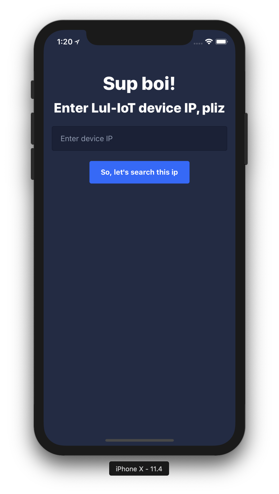

# LulIot

Application for LulzTech's IoT project

## Screenshots

<div align="center">
    <p>Configuration page<p>
    
</div>


## Installation

```bash
# Clone repo
git clone https://github.com/lulz-tech/LulIot.git

# Move to project directory
cd ./LulIot

# Install dependencies
yarn

# Run on iOs
$ react-native run-ios
```